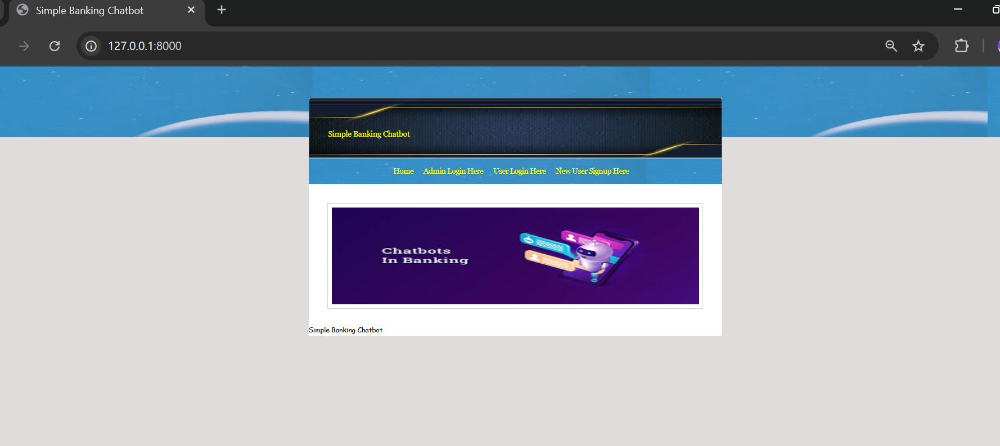
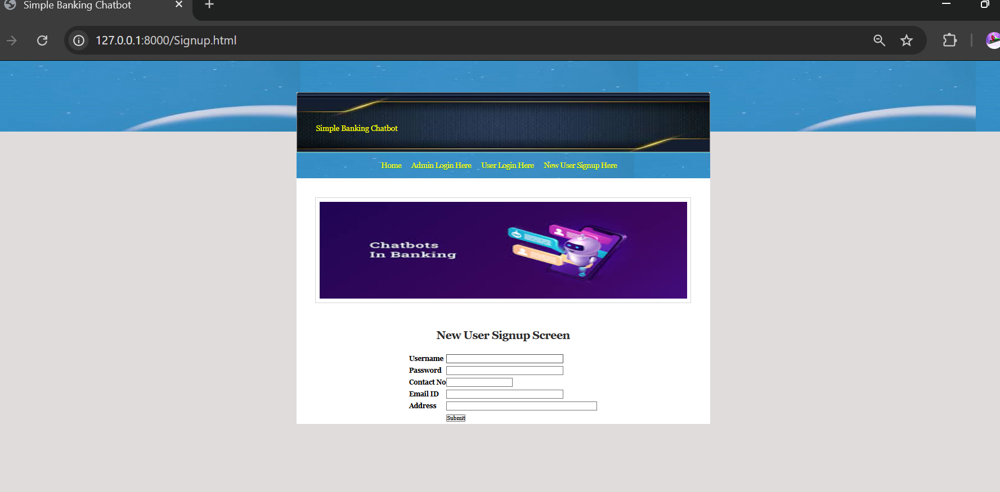
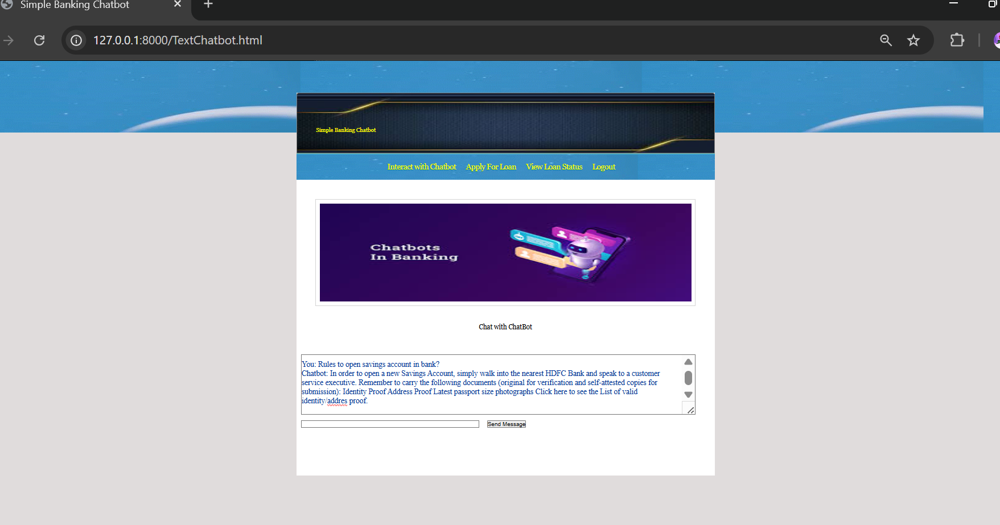
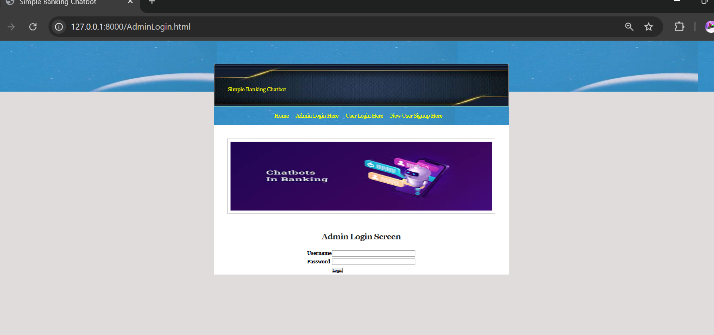
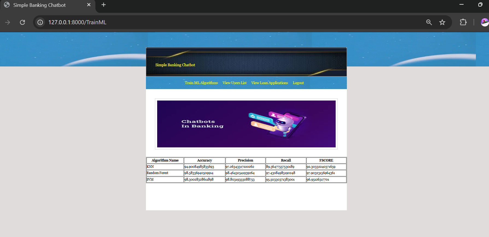

# Simple Banking Chatbot

A Django-based web application for banking services with chatbot functionality.

## Features
- User Signup & Login
- Admin Login
- Chatbot Interaction
- Loan Application System
- Chat History Management

## Tech Stack
- Python (Django)
- MySQL
- HTML, CSS

## Run Project
`bash`
python manage.py runserver

## Screenshots

